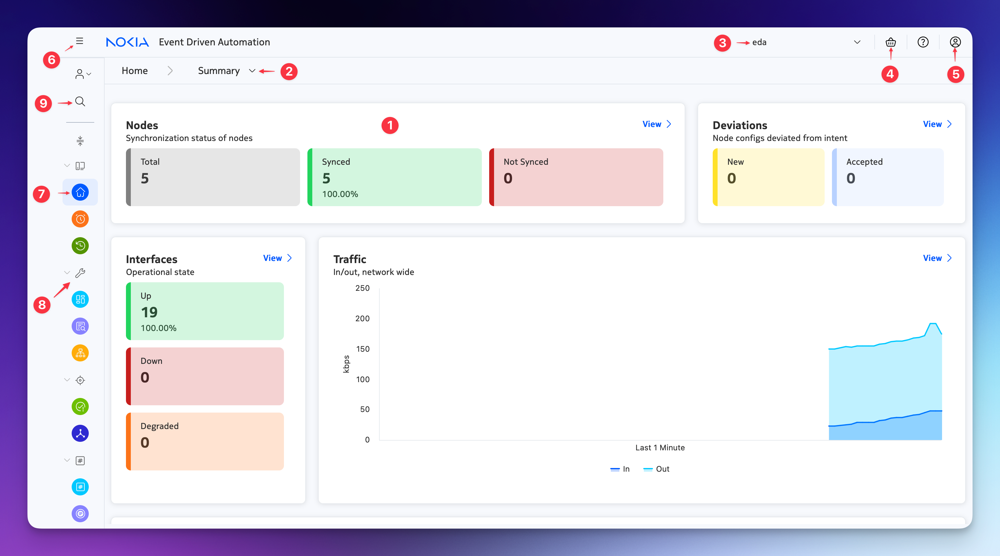
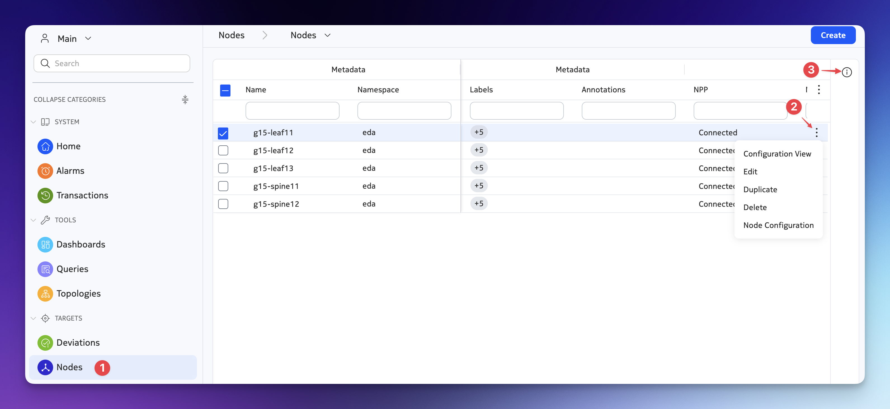
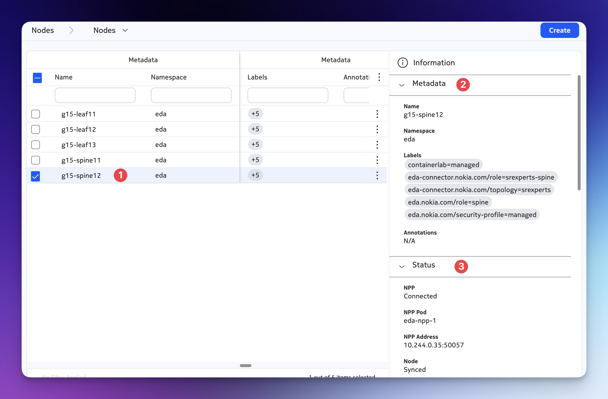
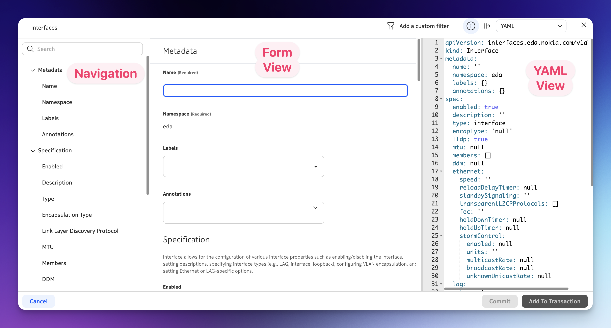
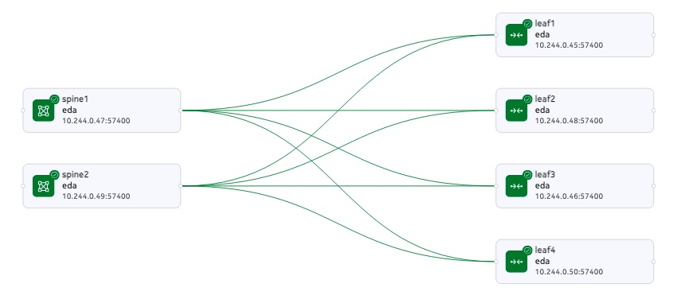
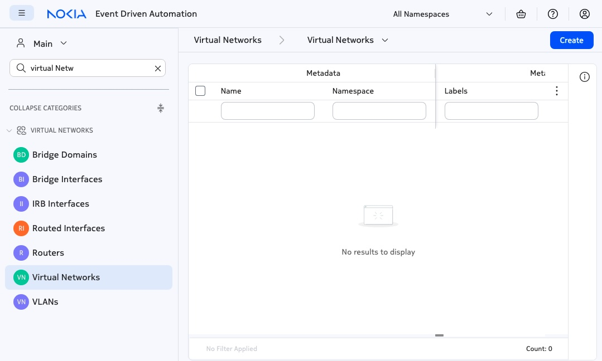
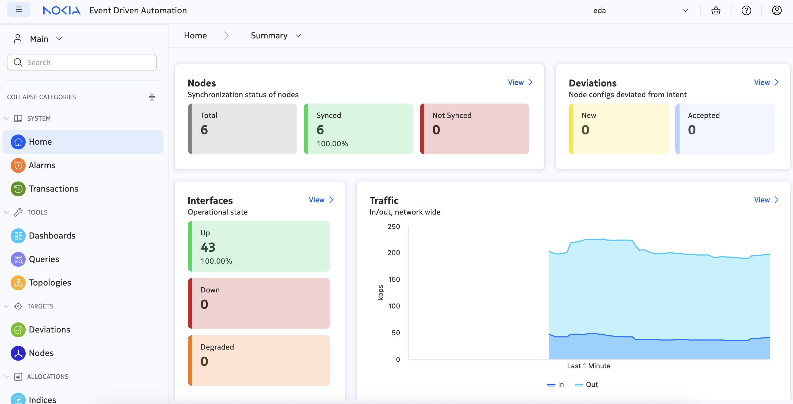
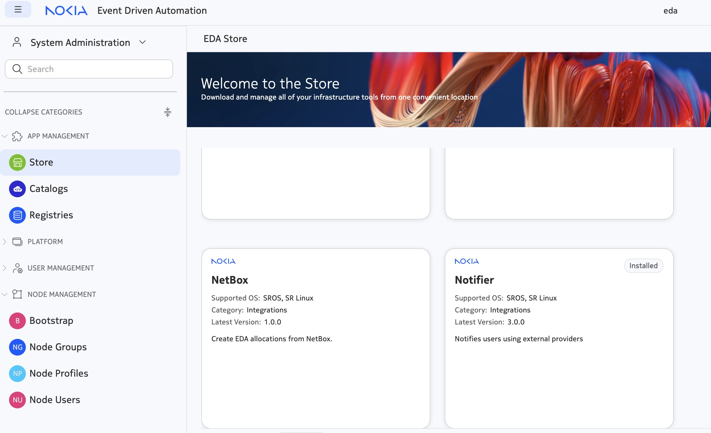

To deliver the "Try EDA" experience, we have created an EDA playground - a repository that contains everything you need to install and provision a demo EDA instance with the virtual network on the side. 

# Installation:
Proceed with cloning the EDA playground repository that contains everything you need to install and provision a demo EDA instance.

```
git clone https://github.com/nokia-eda/playground && \
cd playground
```
- Install Docker using "make" (automated installer) 
```
make install-docker
```
- Ensure the relevant sysctl values are properly sized by pasting and running the following:

```
make configure-sysctl-params
```

- Set the EXT_DOMAIN_NAME environment variable in your shell:
```
export EXT_DOMAIN_NAME=\<x\>.wwrkshpz.net
```
Note: if you want to enable the Natural Language support for the EDA Query functionality, provide the LLM key (OpenAI) with an additional environment variabl.
```
export LLM_API_KEY=\<your-OpenAI-API-key\>
```

- Run the EDA install:
```
make try-eda
```

# Verify the installation

The installation will take approximately 10 minutes to complete. Once it is done, you can optionally verify the installation.
You should be able to use kubectl -n eda-system get pods to verify that EDA core components have started and in the Ready state:
```
kubectl -n eda-system get pods | awk 'NR==1 || /eda/'
```
The list of EDA pods and status should be:
```
NAME                                  READY   STATUS    RESTARTS   AGE
cx-eda--leaf1-sim-864b97d58d-g9zq2    2/2     Running   0          12h
cx-eda--leaf2-sim-6698fc668f-4blcm    2/2     Running   0          12h
cx-eda--spine1-sim-677f5499cf-fn2pg   2/2     Running   0          12h
eda-api-9985cb78-gphnk                1/1     Running   0          12h
eda-appstore-8d679c5b-fqmt6           1/1     Running   0          12h
eda-asvr-dc9877c8d-5j62k              1/1     Running   0          12h
eda-bsvr-6bf77b64c-9l2zx              1/1     Running   0          12h
eda-ce-84c6486cb7-f8jzc               1/1     Running   0          12h
eda-cx-5dc6cf9d96-dcrrf               1/1     Running   0          12h
eda-fe-54d8db877f-xk7l8               1/1     Running   0          12h
eda-fluentbit-hkwvd                   1/1     Running   0          12h
eda-fluentd-54cf4bd5d7-j98zg          1/1     Running   0          12h
eda-git-754df68df5-8kgx4              1/1     Running   0          12h
eda-git-replica-784dbdbfc8-5zdzz      1/1     Running   0          12h
eda-keycloak-5d569565b7-2gmc7         1/1     Running   0          12h
eda-metrics-server-799d54cb7-688nz    1/1     Running   0          12h
eda-npp-eda-leaf1                     1/1     Running   0          12h
eda-npp-eda-leaf2                     1/1     Running   0          12h
eda-npp-eda-spine1                    1/1     Running   0          12h
eda-postgres-cd89bfc57-q56cc          1/1     Running   0          12h
eda-sa-576c98865f-66vq9               1/1     Running   0          12h
eda-sc-84546648c5-djr49               1/1     Running   0          12h
eda-se-1                              1/1     Running   0          12h
eda-toolbox-84c95bd8c6-lqxh7          1/1     Running   0          12h
```

# Some Concepts 
EDA is an automation framework that follows declarative principles. An operator's input is the desired state of the resources and EDA takes care of the deployment, provisioning, configuration and reconciliation of the resource.

What is a Resource? 

In EDA, a reource is anything that can be automatd:
  - an interface on a network device
  - a complete fabric configuration1
  - a network service like a VPN or a VRF2
  - and even non-network related resources like a user account, a DNS record, or a firewall rule.
EDA is built on Kuberntee platform, it represents its resources via Custom Resources (CRs) of Kubernetes that can be created using various methods including the Kubernetes (K8s) API, the EDA API, or through a User Interface (UI).
  

# Try-EDA topology example: 

Try-EDA default make create a topoogy with 2 leafs and 1 spine. This  topology deployed as part of the quickstart resulted in creation of topology nodes, with each node represented by an SR Linux simulator. The topology nodes in EDA are represented by the TopoNode resource, and this resource has a status field to indicate its health.

The easiest way to tell the current state of nodes is via the UI, or via kubectl
```
kubectl -n eda get toponodes
```
```
NAME     PLATFORM       VERSION   OS    ONBOARDED   MODE     NPP         NODE     AGE
leaf1    7220 IXR-D3L   24.10.1   srl   true        normal   Connected   Synced   12h
leaf2    7220 IXR-D3L   24.10.1   srl   true        normal   Connected   Synced   12h
spine1   7220 IXR-D5    24.10.1   srl   true        normal   Connected   Synced   12h
```

Using UI:
```
--> forward the display
```
sudo make start-ui-port-forward
```
--> The UI can be accessed using https://<x>.wrkshpz.net:9443 
--> INFO: EDA is launched
    Username: admin
    Password: admin
```
# Exploring EDA UI 




1. The home page features a dashboard that provides some key information about the managed nodes and their interfaces.
2.  The home page has two dashboards to select from. The page picker lets you do this. The picker will be available on other pages as well.
3.  Namespace selector. When you have more than one namespace (eda is the default namespace) you will be able to switch between them.
4.  Transaction basket. This is where your uncommitted transactions will be stored. Clicking on the basket icon also lets you do operations on the transactions.
5.  User menu. This is where you can change your password, log out, and access the help and about pages.
6.  Side menu toggle. Expands/collapses the left side menu where all EDA apps and menu items are.
7.  Application icon. Clicking on the icon in the collapsed view opens up the application page.
8.  Application category toggle. Can be used to hide/show the application category.
9.  Application search. Type in the search term and the apps list will be filtered.




1. Category
2. Context menu button. Opens up a menu with commands like edit, duplicate, delete.
3. Click on this icon to display the status bar for the selected resource.



1. Resource
2. Metadata
3. Status



1. Navigation bar, aka Form fields
2. Form view
3. YAML view


# Create a Toloplogy 
We will create a new topology of 2 spines and 4 leafs 





before creating a new topology, let's tear down the existing topology 
```
sudo make teardown-topology
```

To create a new topology we will using a yaml file  "fabrci4leafs2spines.yaml"  
```
sudo make TOPO=../images/topo-6nodes.yaml topology-load
```
1. Check the state of the nodes
   ```
   kubectl -n eda get toponodes
   ```
2. Using UI
   Check the resources being created (Topology, nodes, links, interfaces)  

# Create a Fabric  (Fabric resource) 

To put it simply, a Fabric resource represents a DC fabric configuration with all its components like:
- a set of leaf and spine devices
- allocation pools for system IPs, ASN numbers
- inter-switch links flavor (numbered, unnumbered, vlans)
- underlay protocol (eBGP, IGP)
- overlay protocol
At the end of the day, a Fabric resource defines and configures everything a DC fabric needs to support overlay networks or L2/L3 services.

# Pool allocation 
To simplify the automation, of ip assignment in EDA, The concept of pool allocation Pool is defined as a resource of a specific type. Four kinds of allocation pools are available in EDA, each defines a pool with a unique property to cater for a specific allocation use case:

   **Indices** Specify a size and starting value 

   **IP Addresses** Specify an IPv4 or IPv6 subnet including mask in CIDR format (e.g. 192.0.2.0/24)
    Return an address from the subnet on allocation, without any mask information (e.g. 192.0.2.1)
    
   **IP Addresses + Masks** Specify an IPv4 or IPv6 subnet including mask in CIDR format (e.g. 192.0.2.0/24)
    Return an address from the subnet on allocation, with mask information (e.g. 192.0.2.1/24)
    
   **Subnets** Specify an IPv4 or IPv6 subnet including mask in CIDR format (e.g. 192.0.2.0/24) and a subnet length (e.g. 31)
    Return a subnet of the specified length from the provided subnet on allocation, with mask information (e.g. 192.0.2.8/31)
    

Using the UI we will create [myfabric](myfabric.yaml)

- **Commit**, Dry-run and transaction concepts in EDA:
   
The user-submitted declarative intents are all transacted together and either all of them are applied by the nodes or all of them will be rolled back.
The transaction-based model also allows for Dry Runs - seeing what changes will be rolled out to your network before actually applying them.

# Intent and Deviation
TBD , adding FEC to an interface 

# Create an EVPN overlay 

In EDA Layer 2 & Layer 3 EVPN are called "Virtual Networks"
Insert  



The primary components that make up the VNET include:

**BridgeDomain**: Represents a Layer 2 broadcast domain. It is used in conjunction with VLAN and BridgeInterface resources, which attach sub-interfaces to this L2 broadcast domain.

**VLAN**: Groups sub-interfaces together under a common VLAN ID. VLAN IDs can be automatically assigned from a pool or manually set by the user. The VLAN uses a label selector to select the interfaces on which to provisioning the sub-interfaces.

**BridgeInterface**: Allows operators to manually attach a sub-interface to a specific BridgeDomain.

**Router**: Acts as a Layer 3 domain manager. It can connect multiple BridgeDomains through an IRBInterface or link directly to RoutedInterfaces.

**IRBInterface** (Integrated Routing and Bridging Interface): Connects a BridgeDomain to a Router, facilitating communication between Layer 2 and Layer 3 networks.

**RoutedInterface**: Represents a directly connected Layer 3 interface on a device that is attached to a Router.

**DHCPRelay**: Enables DHCP relay functionality on sub-interfaces within the VNET, facilitating dynamic IP address allocation.

- **Layer 2 EVPN**

Using EDA UI, we will create a 2 EVPNs with 2 bridgedomains
- [evpncompute](evpncompute.yaml) with a bridge domain for compute 
- [evpnstorage](evpnstorage.yaml) with bridge domain for storage 

# Levarging the Labels 

EDA uses labels to organize and describe resources. Labels are among the metadata common to all resources in EDA. In the EDA GUI, labels can be viewed and entered in the Metadata panel for a resource.
Labels are not mere descriptions of objects; they are also used throughout EDA as the basis for selecting objects. You can apply the same label to a set of objects and then manipulate them as a group based on that shared label. This makes it easier for system administrators and operators to manage large-scale clusters. 


- Using the label add interfaces to the evpn.
- Using the label remove interfaces from the evpn. 


# Connection to the nodes 

# Network States and Monitoring



In EDA, states and monitoring are an integral part of the system, meaning when a Fabric is created, it shows the Fabric components, states and health of its components 
Let's explore some of the Day 2+ operation. 

# Notification and Application Integration 
In many deployement we are required to integrate with other applciations. One option is to use EDA custom notifier. The EDA Notifier application allows an operator to create custom notifications based on the events registered by EDA and deliver them to popular notification and chat systems.

For today example we will be integrating and sending notification to Discord.
For thefull list of supported webhook providers is available at the [shouterrr docs](https://containrrr.dev/shoutrrr)

1.  Install Notifier app from EDA App store.
2.  Configure Provide
3.  Configure Notifer




```   
apiVersion: notifiers.eda.nokia.com/v1
kind: Provider
metadata:
 name: discord
 namespace: eda-system
spec:
 enabled: true
 uri: <webhook>
```
# EDA RestAPI  


